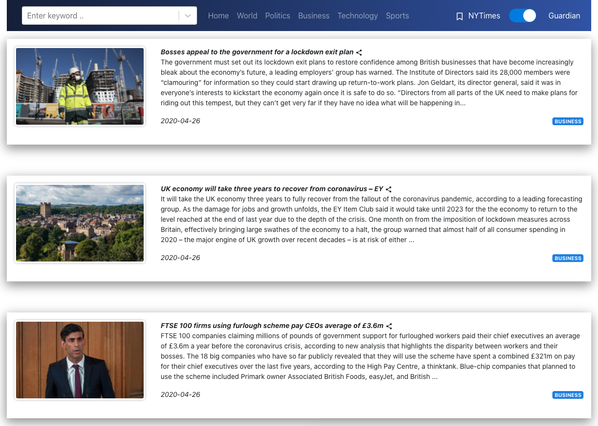

# Newzz - A React News Dashboard

 

Newzz enables you to browse, read, and comment on news articles from the New York Times and The Guardian. Built using React with Nodejs. 

## Demo

Some API keys might expire/be expired. 

Demo here: http://hw8-dulaim.uc.r.appspot.com/
